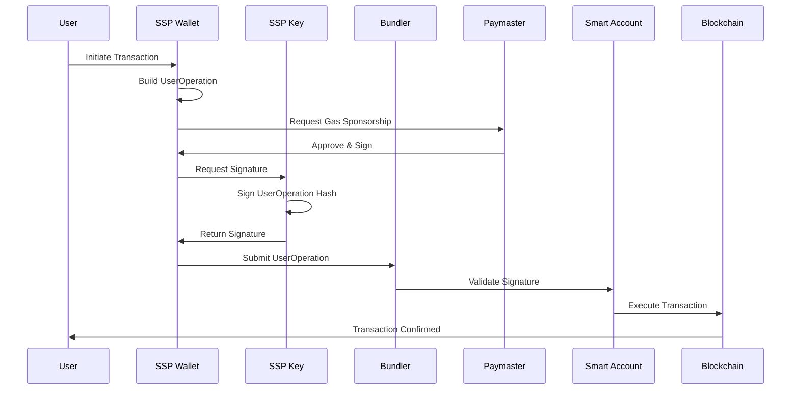

# Account Abstraction Implementation

SSP Wallet implements ERC-4337 Account Abstraction with Schnorr signature multisignature support on EVM-compatible networks, providing advanced smart account capabilities while maintaining the security of the 2-of-2 multisignature architecture.

## Overview

Account Abstraction (AA) represents a paradigm shift in how Ethereum accounts work, enabling smart contract wallets to have the same user experience as Externally Owned Accounts (EOAs) while providing additional programmable features.

SSP Wallet's implementation combines:
- **ERC-4337 Standard**: Industry-standard Account Abstraction protocol
- **Schnorr Signatures**: Advanced cryptographic signatures for efficiency
- **2-of-2 Multisignature**: Maintaining SSP's core security model
- **Custom Validation Logic**: Flexible transaction validation rules

## Technical Architecture

### Smart Account Structure
```solidity
contract SSPSmartAccount {
    // Core validation logic
    function validateUserOp(UserOperation op, bytes32 opHash, uint256 missingAccountFunds)
        external returns (uint256 validationData);
    
    // Execute user operations
    function execute(address dest, uint256 value, bytes calldata func) external;
    
    // Batch execution
    function executeBatch(address[] calldata dest, uint256[] calldata value, bytes[] calldata func) external;
    
    // Schnorr signature validation
    function validateSchnorrSignature(bytes32 hash, bytes calldata signature) internal view returns (bool);
}
```

### Components

#### 1. UserOperation Structure
```typescript
interface UserOperation {
  sender: string;           // Smart account address
  nonce: string;           // Nonce for replay protection
  initCode: string;        // Code to deploy account (if needed)
  callData: string;        // Transaction data
  callGasLimit: string;    // Gas limit for execution
  verificationGasLimit: string; // Gas for verification
  preVerificationGas: string;   // Gas for pre-verification
  maxFeePerGas: string;    // Maximum gas fee
  maxPriorityFeePerGas: string; // Priority fee
  paymasterAndData: string; // Paymaster info
  signature: string;        // Schnorr multisig signature
}
```

#### 2. Schnorr Multisignature Validation
The smart account validates Schnorr signatures from both SSP Wallet and SSP Key:

```typescript
class SchnorrMultisigValidator {
  public validateSignature(
    userOpHash: string,
    signature: string,
    publicKey1: string,
    publicKey2: string
  ): boolean {
    // Verify both signatures are valid
    const sig1Valid = this.verifySchnorrSignature(userOpHash, signature.slice(0, 64), publicKey1);
    const sig2Valid = this.verifySchnorrSignature(userOpHash, signature.slice(64, 128), publicKey2);
    
    return sig1Valid && sig2Valid;
  }
}
```

## Key Features

### 1. Gasless Transactions
Users can execute transactions without holding ETH for gas fees through paymaster sponsorship:

```typescript
// Example: Sponsored transaction
const userOp = await smartAccount.buildUserOperation({
  target: tokenContract,
  data: transferCalldata,
  value: 0,
  paymaster: sponsorPaymaster, // Sponsor pays gas fees
});

const signature = await sspWallet.signUserOperation(userOp);
await bundler.submitUserOperation(userOp, signature);
```

### 2. Batch Operations
Execute multiple transactions atomically in a single operation:

```typescript
const batchOps = [
  {
    target: usdcContract,
    data: encodeApproval(spender, amount),
    value: 0
  },
  {
    target: dexContract,
    data: encodeSwap(tokenIn, tokenOut, amount),
    value: 0
  },
  {
    target: stakingContract,
    data: encodeStake(amount),
    value: 0
  }
];

await smartAccount.executeBatch(batchOps);
```

### 3. Session Keys
Temporary permissions for specific dApps without requiring full wallet access:

```typescript
interface SessionKey {
  publicKey: string;
  validUntil: number;
  validAfter: number;
  permissions: {
    allowedTargets: string[];
    maxAmount: string;
    allowedFunctions: string[];
  };
}

// Create session key for a gaming dApp
const sessionKey = await sspWallet.createSessionKey({
  validFor: 7 * 24 * 60 * 60, // 7 days
  permissions: {
    allowedTargets: [gameContract],
    maxAmount: parseEther("0.1"),
    allowedFunctions: ["play", "claim"]
  }
});
```

### 4. Social Recovery
Enhanced account recovery through trusted guardians:

```typescript
interface GuardianRecovery {
  guardians: string[];
  threshold: number;
  recoveryDelay: number;
}

// Set up social recovery
await smartAccount.setupSocialRecovery({
  guardians: [guardian1, guardian2, guardian3],
  threshold: 2, // 2 out of 3 guardians needed
  recoveryDelay: 48 * 60 * 60 // 48 hours delay
});
```

## Implementation Details

### UserOperation Lifecycle



### Signature Generation Process

1. **UserOperation Hash**: Create deterministic hash of operation
2. **Dual Signing**: Both SSP Wallet and SSP Key sign the hash
3. **Signature Aggregation**: Combine signatures using Schnorr aggregation
4. **Validation**: Smart contract verifies both signatures

```typescript
// Signature generation
const userOpHash = getUserOperationHash(userOp, entryPoint, chainId);

// Sign with both devices
const signature1 = await sspWallet.signHash(userOpHash);
const signature2 = await sspKey.signHash(userOpHash);

// Combine signatures
const combinedSignature = combineSchnorrSignatures(signature1, signature2);
userOp.signature = combinedSignature;
```

## Security Enhancements

### 1. Multi-Layer Validation
- **Signature Validation**: Schnorr multisignature verification
- **Nonce Management**: Replay attack prevention
- **Gas Validation**: Prevent gas griefing attacks
- **Target Validation**: Whitelist of allowed contract interactions

### 2. Risk Management
```typescript
interface RiskPolicy {
  dailySpendLimit: string;
  singleTxLimit: string;
  allowedTokens: string[];
  blockedAddresses: string[];
  timeWindows: {
    start: number;
    end: number;
  }[];
}
```

### 3. Emergency Controls
- **Account Freezing**: Temporary suspension of operations
- **Recovery Mode**: Fallback mechanisms for lost devices
- **Upgrade Protection**: Secure contract upgrade procedures

## Gas Optimization

### 1. Signature Aggregation
Schnorr signatures enable efficient aggregation, reducing gas costs:

```solidity
// Optimized validation
function validateSchnorrMultisig(bytes32 hash, bytes calldata signature) 
    internal view returns (bool) {
    // Single verification call for aggregated signature
    return SchnorrVerifier.verify(hash, signature, aggregatePublicKey);
}
```

### 2. Batch Operations
Reduce individual transaction overhead through batching:

```typescript
// Gas savings through batching
const individualGas = estimateGas(tx1) + estimateGas(tx2) + estimateGas(tx3);
const batchGas = estimateGas(batchTx);
const savings = individualGas - batchGas; // Typically 20-40% savings
```

## Development SDK

### Installation
```bash
npm install @runonflux/aa-schnorr-multisig-sdk
```

### Basic Usage
```typescript
import { SSPAccountAbstraction } from '@runonflux/aa-schnorr-multisig-sdk';

const aa = new SSPAccountAbstraction({
  provider: ethersProvider,
  entryPoint: ENTRY_POINT_ADDRESS,
  bundlerUrl: "https://bundler.example.com",
});

// Create smart account
const smartAccount = await aa.createAccount({
  publicKey1: sspWalletPublicKey,
  publicKey2: sspKeyPublicKey,
});

// Execute transaction
const userOp = await smartAccount.execute({
  target: tokenContract,
  data: transferCalldata,
  value: 0,
});
```

### Advanced Configuration
```typescript
const aa = new SSPAccountAbstraction({
  provider: ethersProvider,
  entryPoint: ENTRY_POINT_ADDRESS,
  bundlerUrl: "https://bundler.example.com",
  paymasterUrl: "https://paymaster.example.com",
  options: {
    gasMultiplier: 1.2, // 20% gas buffer
    maxRetries: 3,
    retryDelay: 1000,
    enableBatching: true,
    enableSessionKeys: true,
  }
});
```

## Supported Networks

### EVM Networks (Account Abstraction with ERC-4337)
- **Ethereum Mainnet**: Full feature support (Chain ID: 1)
- **Polygon**: Low-cost operations (Chain ID: 137)
- **Base**: Coinbase L2 integration (Chain ID: 8453)
- **Binance Smart Chain**: BEP-20 support (Chain ID: 56)
- **Avalanche**: C-Chain compatibility (Chain ID: 43114)

### EVM Testnets
- **Sepolia**: Ethereum testnet (Chain ID: 11155111)
- **Amoy**: Polygon testnet (Chain ID: 80002)

**Note:** Account Abstraction is only available on EVM-compatible networks. UTXO networks (Bitcoin, Litecoin, Dogecoin, etc.) use native multisignature implementations and do not support Account Abstraction features.

### Under Evaluation
The following networks are being evaluated for future support:
- **Cardano**: Multi-signature implementation research in progress
- **Cosmos**: Inter-blockchain communication and multisig evaluation
- **TRON**: TRC-20 and native multisig assessment
- **NEAR**: Account model and multisig capabilities evaluation

## Best Practices

### 1. Gas Management
- Use paymasters for sponsored transactions
- Batch operations when possible
- Set appropriate gas limits
- Monitor gas price fluctuations

### 2. Security Considerations
- Validate paymaster trustworthiness
- Implement spending limits
- Regular security audits
- Monitor unusual activity patterns

### 3. User Experience
- Clear transaction previews
- Progress indicators
- Error handling and recovery
- Educational materials

## Future Roadmap

### Short Term
- Enhanced paymaster integration
- Additional network support
- Improved gas estimation
- Mobile SDK optimization

### Long Term
- Cross-chain operations
- Advanced recovery mechanisms
- Institutional features
- Regulatory compliance tools

SSP Wallet's Account Abstraction implementation represents a significant advancement in smart contract wallet technology, combining the security benefits of multisignature architecture with the flexibility and user experience improvements of programmable accounts.