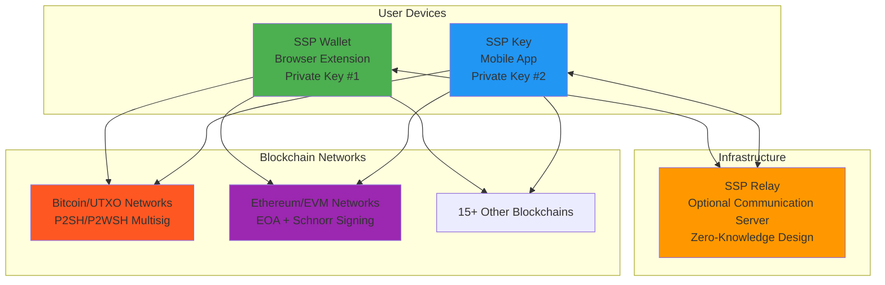

# How SSP Components Work Together

## The Complete SSP Ecosystem

SSP consists of **three core components** working together to provide secure, user-friendly cryptocurrency management using **traditional 2-of-2 multisignature technology**:



## Component Deep Dive

### 🌐 SSP Wallet (Browser Extension)
**Primary Key Holder & User Interface**

- **Purpose**: Main interface for wallet management and transaction initiation
- **Key Role**: Holds first private key (Key #1) of the 2-of-2 multisig pair
- **Platforms**: Chrome, Firefox, Brave, Edge
- **Built With**: React 19, TypeScript, Vite
- **Architecture**: Manifest v3 browser extension

#### Core Responsibilities:
- 👤 User interface for all wallet operations across 15+ blockchains
- 🔑 Generate and securely store first BIP48-derived private key
- 💸 Construct transactions for UTXO and EVM networks
- 🔄 Coordinate with SSP Key for transaction approval
- 🌍 Multi-blockchain support with network-specific optimizations
- 🔗 WalletConnect v2 integration for dApp connectivity

#### Supported Address Types:
- **Bitcoin/UTXO**: P2SH, P2WSH (SegWit) multisignature addresses
- **Ethereum/EVM**: Standard EOA addresses with Schnorr multisig message signing
- **Account Abstraction**: Optional smart contract wallets on EVM chains

### 📱 SSP Key (Mobile App)
**Secondary Key Holder & Transaction Authorizer**

- **Purpose**: Secure mobile 2FA device for transaction authorization
- **Key Role**: Holds second private key (Key #2) of the 2-of-2 multisig pair
- **Platforms**: iOS 15.1+, Android 7+
- **Built With**: React Native 0.78, TypeScript
- **Security**: React Native Keychain + MMKV encrypted storage

#### Core Responsibilities:
- 🔐 Generate and store second BIP48-derived private key independently
- ✅ Review transaction details and approve/reject on mobile interface
- 📱 Receive push notifications for transaction requests (FCM/APNS)
- 🔄 Synchronize with SSP Wallet via QR codes or optional relay server
- 📤 Complete multisignature transactions using Schnorr signatures
- 🛡️ Independent security layer with biometric authentication

#### Key Security Features:
- **iOS**: Keychain Services integration with Face ID/Touch ID
- **Android**: Android Keystore with fingerprint authentication
- **Encryption**: AES-256 with device fingerprinting
- **Offline Capable**: Full functionality via QR code scanning

### ⚡ SSP Relay (Communication Server)
**Optional Zero-Knowledge Communication Bridge**

- **Purpose**: Optional server to facilitate communication between devices
- **Key Role**: Message relay only - **never accesses or stores private keys**
- **Infrastructure**: Node.js 20+, MongoDB, WebSocket, REST API
- **Security**: Zero-knowledge architecture, end-to-end encryption
- **Alternative**: Full offline operation available via QR codes

#### Core Responsibilities:
- 📡 Relay encrypted messages between SSP Wallet and SSP Key
- 🔄 Coordinate device synchronization process (optional)
- 📊 Provide blockchain data, network fees, and UTXO information
- 🌐 Support for 15+ blockchain networks via various APIs
- 🚀 WebSocket connections for real-time communication
- 📈 Caching and performance optimization

#### Zero-Knowledge Design:
- ❌ **Never sees**: Private keys, seed phrases, transaction details
- ✅ **Only handles**: Encrypted message passing and public blockchain data
- ✅ **Alternative**: Users can operate completely offline with QR codes

## Communication Flow

### Initial Setup & Synchronization

#### Online Synchronization (via SSP Relay)
```
SSP Wallet                SSP Relay (Optional)       SSP Key
    |                         |                         |
    |--- Generate QR Code ---->|                         |
    |    (Contains xPub)       |<--- Scan QR Code -------|
    |                         |   (Extract xPub)        |
    |<-- Exchange xPubs -------|<-- Exchange xPubs ------|
    |                         |                         |
    |<-- Generate Multisig --->|<-- Generate Multisig -->|
    |    Addresses (BIP48)     |    Addresses (BIP48)    |
    |                         |                         |
    |--- Sync Confirmed ------>|--- Sync Confirmed ----->|
```

#### Offline Synchronization (QR Code Only)
```
SSP Wallet                                    SSP Key
    |                                           |
    |--- Display QR Code (xPub) -------------->|
    |                                           |
    |<-- Display QR Code (xPub) ---------------|
    |                                           |
    |--- Both devices generate identical ------|
    |    multisig addresses using BIP48        |
```

### Transaction Process

#### Online Transaction Flow
```
SSP Wallet                SSP Relay                SSP Key
    |                         |                         |
    |--- Create Transaction -->|                         |
    |    (UTXO or EVM)         |--- Push Notification -->|
    |    Signed with Key #1    |                         |
    |                         |<-- User Reviews Tx -----|
    |                         |<-- Signs with Key #2 ---|
    |<-- Complete Multisig ---|                         |
    |    Transaction           |                         |
    |--- Broadcast to Network->|                         |
```

#### Offline Transaction Flow
```
SSP Wallet                                    SSP Key
    |                                           |
    |--- Display Unsigned Tx QR Code --------->|
    |                                           |
    |<-- Display Signed Tx QR Code ------------|
    |                                           |
    |--- Scan, Combine, & Broadcast Tx -------|
```

## Security Architecture

### 🔐 **Traditional Multisignature Security**
- **True 2-of-2**: Both private keys required for every transaction
- **BIP48 Derivation**: Industry-standard hierarchical deterministic keys
- **Network Native**: Uses each blockchain's native multisig capabilities
- **No Single Point of Failure**: Compromise of one device doesn't affect funds

### 🛡️ **Device-Level Protection**
1. **SSP Wallet**: Browser extension with encrypted local storage
2. **SSP Key**: Mobile app with hardware-backed key storage
3. **Communication**: Optional relay server with zero-knowledge design
4. **Backup**: User-controlled seed phrase backup (no cloud storage)

### 🔄 **Redundant Verification**
- Address validation on both devices during setup
- Transaction details verification before signing
- Network-specific validation before broadcast
- Optional offline operation for maximum security

## Data Flow & Storage

### SSP Wallet Storage (Browser Extension)
- ✅ **Encrypted with AES-256**: BIP48 private key with password-based encryption
- ✅ **Device Fingerprinted**: Encryption tied to specific browser and device
- ✅ **Local Storage**: Transaction history, contacts via LocalForage
- ✅ **Session Storage**: Temporary password caching for user convenience
- ✅ **No Cloud Sync**: All data remains on user's local device

### SSP Key Storage (Mobile App)
- ✅ **React Native Keychain**: iOS Keychain Services/Android Keystore
- ✅ **MMKV Encrypted**: High-performance encrypted local database
- ✅ **Device-Specific Encryption**: Uses device fingerprint + user PIN/biometric
- ✅ **Biometric Integration**: Face ID/Touch ID/Fingerprint authentication
- ✅ **User-Controlled Backup**: Seed phrase backup managed by user

### SSP Relay Storage (Zero-Knowledge)
- ❌ **No Private Keys**: Never sees, stores, or accesses private keys
- ❌ **No Seed Phrases**: No access to wallet recovery information
- ✅ **Message Queue**: Temporary encrypted message passing only
- ✅ **Blockchain Data**: Public UTXO and network information caching
- ✅ **Performance Data**: Network fees and transaction estimation

## Integration Points

### Blockchain Networks (Actual Implementation)
Based on `/src/storage/blockchains.ts`:

#### UTXO Networks (Native Multisignature)
- **Bitcoin**: P2WSH multisig addresses, RBF support, SegWit optimization
- **Litecoin**: P2WSH multisig, 2.5-minute blocks, low fees
- **Dogecoin**: P2SH multisig, high throughput, meme-friendly
- **Bitcoin Cash**: P2SH multisig, cashaddr format, BCH-specific features
- **Ravencoin**: P2SH multisig, asset creation and transfers
- **Zcash**: P2SH multisig, transparent addresses (shielded coming)
- **Flux**: P2SH multisig, native integration with Flux ecosystem

#### EVM Networks (EOA + Schnorr Signing)
- **Ethereum (Chain ID: 1)**: Schnorr multisig message signing, Account Abstraction
- **Polygon (Chain ID: 137)**: Low-cost transactions, full EVM compatibility
- **BSC (Chain ID: 56)**: High throughput, Binance ecosystem integration
- **Base (Chain ID: 8453)**: Coinbase L2, optimized user experience
- **Avalanche (Chain ID: 43114)**: Sub-second finality, C-Chain compatibility

### External Service Integration
- **WalletConnect v2**: Full protocol support with Schnorr multisig compatibility
- **Onramper**: Integrated fiat-to-crypto onramp services
- **Blockbook/Insight**: UTXO network APIs for Bitcoin-like chains
- **Alchemy**: Premium Ethereum infrastructure provider
- **Etherspot**: Account Abstraction bundler services

## Performance Characteristics

### Network-Specific Optimization
- **UTXO Networks**: Efficient UTXO selection and fee optimization
- **EVM Networks**: Gas price optimization and transaction batching
- **Cross-Chain**: Unified interface across different blockchain architectures

### Scaling Capabilities
- **Concurrent Users**: Thousands per relay instance
- **Transaction Throughput**: Limited by blockchain networks, not SSP
- **Network Efficiency**: Optimized API calls and caching strategies
- **Offline Operations**: Full functionality without internet connectivity

## Monitoring & Health

### System Health Indicators
- 🟢 **Device Sync Status**: Real-time synchronization between wallet and key
- 🟢 **Network Connectivity**: Blockchain node and API endpoint health
- 🟢 **Relay Server Status**: Optional communication server availability
- 🟢 **Transaction Queue**: Pending and confirmed transaction status

### Error Recovery Mechanisms
- **Automatic Reconnection**: Network interruption handling
- **State Synchronization**: Consistent state across devices and sessions
- **Offline Mode Activation**: Seamless QR code fallback
- **Transaction Retry Logic**: Failed transaction recovery procedures

## Next Steps

- **[Introduction to 2-of-2 Multisignature](multisig-introduction.md)** - Core security concepts
- **[BIP48 Key Derivation Explained](bip48-derivation.md)** - Technical key generation details
- **[Security Architecture Deep Dive](security-architecture.md)** - Comprehensive security analysis
- **[Communication Protocol](communication-protocol.md)** - Detailed communication flows