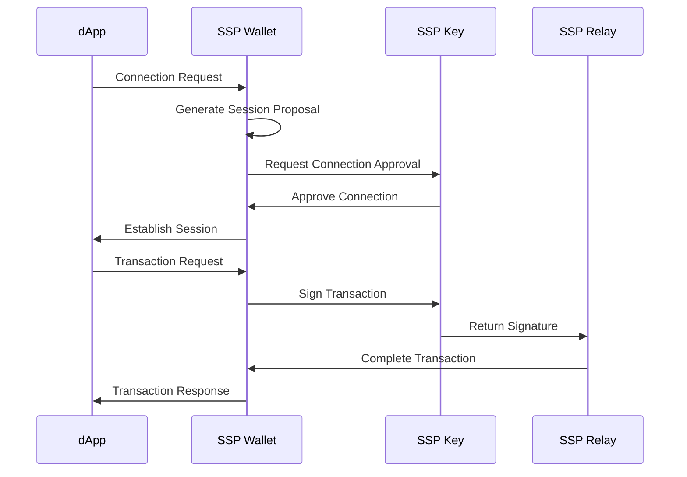

# WalletConnect v2 Integration (Reown)

SSP Wallet features comprehensive WalletConnect v2 support (now **Reown**), enabling seamless integration with thousands of decentralized applications (dApps) on EVM-compatible blockchain networks while maintaining the security of the 2-of-2 multisignature architecture.

## Overview

WalletConnect v2 (rebranded as **Reown**) is the leading protocol for connecting wallets to dApps, providing a secure and standardized way to interact with the decentralized web on EVM-compatible networks. SSP Wallet's implementation ensures that all the security benefits of the multisignature system are preserved during dApp interactions.

## Key Features

### Universal dApp Compatibility
- Connect to any WalletConnect-enabled dApp
- Support for DeFi protocols, NFT marketplaces, and trading platforms
- Seamless integration with popular dApps like Uniswap, OpenSea, and Aave

### EVM-Compatible Chain Support
SSP Wallet's WalletConnect integration supports:
- **Ethereum Mainnet** - Full DeFi ecosystem access
- **Polygon** - Low-cost transactions and gaming dApps
- **Binance Smart Chain (BSC)** - Diverse DeFi options
- **Avalanche** - High-speed transactions and DeFi protocols
- **Base** - Coinbase Layer 2 with growing consumer apps

**Important:** WalletConnect only works with EVM-compatible networks. Bitcoin, Litecoin, Dogecoin, and other UTXO networks do not support WalletConnect protocol.

### Advanced Transaction Types
- **Standard Transactions**: Send/receive tokens and interact with contracts
- **EIP-712 Message Signing**: Full support for typed structured data signing
- **Batch Transactions**: Execute multiple operations in a single transaction
- **Contract Interactions**: Direct smart contract calls with parameter validation

## Technical Implementation

### Connection Flow


### Security Architecture

#### 2-of-2 Multisignature Preservation
- All WalletConnect transactions still require both SSP Wallet and SSP Key approval
- Private keys never leave their respective devices
- Transaction signing follows the standard SSP security protocol

#### Session Management
- Secure WebSocket connections for real-time communication
- Session expiration and renewal mechanisms
- Automatic cleanup of inactive sessions

### Supported Methods

#### Standard Methods
- `eth_sendTransaction`: Execute standard Ethereum transactions
- `personal_sign`: Sign arbitrary messages
- `eth_sign`: Basic message signing
- `eth_signTypedData_v4`: EIP-712 structured data signing

#### Chain-Specific Methods
- `wallet_switchEthereumChain`: Network switching
- `wallet_addEthereumChain`: Add custom networks
- `wallet_watchAsset`: Add custom tokens

## Account Abstraction Support

SSP Wallet's WalletConnect integration includes native support for ERC-4337 Account Abstraction:

### Features
- **Gasless Transactions**: Sponsored transaction execution
- **Batch Operations**: Multiple actions in single transaction
- **Session Keys**: Temporary permissions for specific dApps
- **Social Recovery**: Enhanced account recovery options

### Smart Account Capabilities
```typescript
// Example: Batch transaction with Account Abstraction
const batchOps = [
  {
    target: tokenContract,
    data: encodeTransfer(recipient, amount),
    value: 0
  },
  {
    target: stakingContract,
    data: encodeStake(amount),
    value: 0
  }
];

await smartAccount.executeBatch(batchOps);
```

## EIP-712 Message Signing

SSP Wallet provides full support for EIP-712 typed structured data signing, which is essential for modern dApp interactions:

### Supported Types
- Domain separators for security
- Primary types and nested structures
- Array and primitive data types
- Custom message formats

### Example Implementation
```typescript
const domain = {
  name: 'Example dApp',
  version: '1',
  chainId: 1,
  verifyingContract: '0x...'
};

const types = {
  Order: [
    { name: 'trader', type: 'address' },
    { name: 'amount', type: 'uint256' },
    { name: 'nonce', type: 'uint256' }
  ]
};

const message = {
  trader: '0x...',
  amount: '1000000000000000000',
  nonce: 123
};

// SSP Wallet handles the signing with both devices
const signature = await ssp.signTypedData(domain, types, message);
```

## Development Integration

### For dApp Developers
```javascript
// Initialize WalletConnect connection (Reown)
import { createWeb3Modal, defaultWagmiConfig } from '@web3modal/wagmi/react'
import { WagmiConfig } from 'wagmi'
import { arbitrum, mainnet, polygon, bsc, avalanche, base } from 'wagmi/chains'

const chains = [mainnet, polygon, bsc, avalanche, base]
const wagmiConfig = defaultWagmiConfig({ chains, projectId: 'YOUR_PROJECT_ID' })

// Create modal
createWeb3Modal({ wagmiConfig, projectId: 'YOUR_PROJECT_ID', chains })

// Connect to SSP Wallet
await web3Modal.open()

// Send transaction (EVM chains only)
const result = await connector.sendTransaction({
  to: '0x...',
  value: '1000000000000000000', 
  data: '0x...',
  chainId: 1 // Ethereum mainnet
});
```

### Configuration Options
- Custom RPC endpoints for different networks
- Gas estimation and fee customization
- Transaction timeout and retry logic
- Error handling and user feedback

## Security Considerations

### Best Practices
1. **Verify Connection Requests**: Always review dApp permissions carefully
2. **Monitor Session Activity**: Regularly check active WalletConnect sessions
3. **Use Trusted dApps**: Only connect to verified and audited applications
4. **Review Transaction Details**: Carefully examine all transaction parameters

### Risk Mitigation
- Automatic session expiration
- Transaction amount limits
- Suspicious activity detection
- Real-time security alerts

## Troubleshooting

### Common Issues
- **Connection Failures**: Check network connectivity and QR code validity
- **Transaction Delays**: Network congestion may cause slower confirmations
- **Session Expiry**: Re-establish connection if session becomes inactive

### Support Resources
- WalletConnect debugging tools
- SSP Wallet connection logs
- Community support channels
- Technical documentation

## Future Enhancements

### Planned Features
- WalletConnect v3 migration support
- Enhanced session management
- Custom permission systems
- Advanced gas optimization

### Integration Roadmap
- Support for additional blockchain networks
- Enhanced Account Abstraction features
- Improved user experience flows
- Developer SDK improvements

The WalletConnect v2 integration in SSP Wallet represents a significant advancement in secure dApp connectivity, combining the convenience of universal dApp access with the robust security of 2-of-2 multisignature technology.