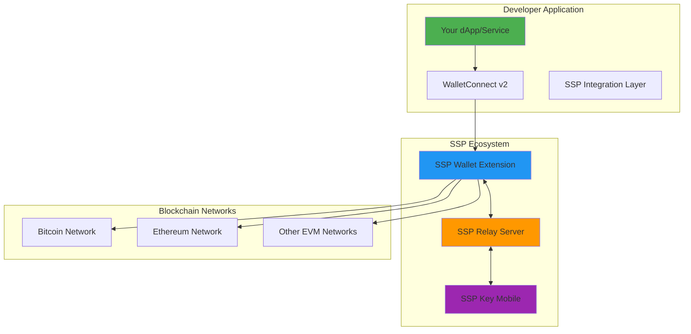

# Getting Started for Developers

## Welcome to SSP Development

SSP Wallet provides a comprehensive ecosystem for developers to build secure, multisignature-enabled applications. This guide will get you started with integrating SSP's unique 2-of-2 multisignature capabilities into your projects.

## 🏗️ SSP Development Stack

### Core Technologies (Actual Implementation)
```typescript
// SSP Wallet Browser Extension (Current: v1.21.0)
React 19 + TypeScript + Vite
Manifest v3 Web Extension
Chrome 110+, Firefox 110+, Edge support
BIP48 HD Key Derivation (@scure/bip32, @scure/bip39)
Schnorr Multisig (@runonflux/aa-schnorr-multisig-sdk 1.2.1)
Ethers.js 6.15.0 for EVM interactions
LocalForage for encrypted storage
Window provider: window.ssp

// SSP Key Mobile App (Current: v1.15.0)
React Native 0.81 + TypeScript
iOS 15.1+ / Android 7+ support
Package: io.runonflux.sspkey
React Native Keychain 10.0.0 for secure storage
MMKV 3.3.0 for encrypted local database
Firebase Messaging for push notifications

// SSP Relay Server (Optional)
Node.js 20+ + TypeScript + MongoDB
WebSocket + REST API for communication
Zero-knowledge design (no private key access)
Integration with various blockchain APIs
```

### Architecture Overview


## 🚀 Quick Integration Options

### 1. WalletConnect Integration (Recommended)
**Best for**: dApps, DeFi protocols, NFT marketplaces

```typescript
// Install WalletConnect
npm install @walletconnect/web3wallet @walletconnect/utils

// Basic WalletConnect setup
import { createWeb3Wallet } from '@walletconnect/web3wallet'

const web3wallet = await createWeb3Wallet({
  core: core, // WalletConnect Core instance
  metadata: {
    name: 'Your dApp Name',
    description: 'Your dApp Description',
    url: 'https://yourdapp.com',
    icons: ['https://yourdapp.com/icon.png']
  }
});

// SSP Wallet will appear as a connection option
await web3wallet.pair({ uri: wcUri });
```

### 2. Direct Browser Extension Integration
**Best for**: Web applications that need direct SSP integration

```typescript
// SSP Wallet injects a provider into the window object
declare global {
  interface Window {
    ssp?: {
      request: (method: string, params?: any[]) => Promise<any>;
    };
  }
}

// Check if SSP Wallet is installed
if (typeof window.ssp !== 'undefined') {
  try {
    // Request account access
    const accounts = await window.ssp.request('eth_requestAccounts');
    
    // Send transaction (requires both browser and mobile device approval)
    const txHash = await window.ssp.request('eth_sendTransaction', [{
      to: '0x...',
      value: '0x...',
      data: '0x',
      gasLimit: '0x...',
      gasPrice: '0x...'
    }]);
  } catch (error) {
    console.error('SSP request failed:', error);
  }
}

// Note: All transactions require 2-of-2 multisig approval
// User must confirm on both browser extension AND mobile app
```

### 3. Schnorr Multisig Integration
**Best for**: Advanced applications needing SSP's unique multisig features

```typescript
// Install SSP's Schnorr multisig SDK
npm install @runonflux/aa-schnorr-multisig-sdk

import * as aaSchnorrMultisig from '@runonflux/aa-schnorr-multisig-sdk';

// This is used internally by SSP for message signing
// External developers typically use WalletConnect or window.sspwallet

// Example: Verify a Schnorr multisig signature
const isValidSignature = await contract.isValidSignature(
  messageHash,
  schnorrSignatureData
);
// Returns ERC1271 magic value 0x1626ba7e if valid
```

## 🔧 Development Environment Setup

### Prerequisites
```bash
# Node.js and package managers
node --version    # v20+ required
npm --version     # or yarn/pnpm

# Git for cloning repositories
git --version

# Code editor with TypeScript support
# VS Code, WebStorm, or similar
```

### Local Development Setup

**Note**: SSP development primarily involves integrating with the existing SSP Wallet extension and mobile app.

```bash
# Option 1: Build from source (advanced)
git clone https://github.com/RunOnFlux/ssp-wallet.git
cd ssp-wallet
npm install
npm run build:chrome  # or build:firefox

# Option 2: Test with existing SSP Wallet
# Install SSP Wallet from browser extension store (when available)
# Or load unpacked extension from build output

# Create test application
npm create vite@latest my-ssp-app --template react-ts
cd my-ssp-app
npm install
```

### Environment Variables
```bash
# .env.development
VITE_WALLETCONNECT_PROJECT_ID=your_project_id
VITE_NETWORK_ENV=testnet

# .env.production  
VITE_WALLETCONNECT_PROJECT_ID=your_project_id
VITE_NETWORK_ENV=mainnet

# Note: SSP Relay URLs vary by deployment
# Default SSP installation uses different relay endpoints
# Check sspwallet.io for current relay information
```

## 📚 Core Integration Patterns

### 1. Basic Transaction Flow
```typescript
// Standard Ethereum transaction request
interface TransactionRequest {
  to: string;
  value: string; // In hex format, e.g., '0x9184e72a000' for 0.01 ETH
  data?: string; // Contract interaction data
  gas?: string;  // Gas limit
  gasPrice?: string; // Legacy gas pricing
  maxFeePerGas?: string; // EIP-1559 gas pricing
  maxPriorityFeePerGas?: string; // EIP-1559 priority fee
}

// Send transaction through SSP
async function sendTransaction(txRequest: TransactionRequest) {
  try {
    // 1. Request sent to SSP Wallet extension
    const txHash = await window.sspwallet!.request({
      method: 'eth_sendTransaction',
      params: [txRequest]
    });
    
    // 2. SSP Wallet constructs transaction and requests approval
    // 3. SSP Key receives push notification
    // 4. User reviews and approves on mobile device
    // 5. Transaction is completed with 2-of-2 multisig and broadcast
    
    return txHash;
  } catch (error) {
    if (error.code === 4001) {
      console.log('User rejected transaction');
    } else {
      console.error('Transaction failed:', error);
    }
    throw error;
  }
}
```

### 2. Message Signing (Schnorr Multisig)
```typescript
// EIP-712 structured data signing with SSP's Schnorr multisig
async function signTypedData(account: string, typedData: any) {
  // SSP implements advanced Schnorr multisig for message signing
  const signature = await window.sspwallet!.request({
    method: 'eth_signTypedData_v4',
    params: [account, JSON.stringify(typedData)]
  });
  
  // Returns Schnorr multisig signature that can be verified on-chain
  // using SSP's deployed contracts
  return signature;
}

// Personal message signing with 2-of-2 multisig
async function signPersonalMessage(account: string, message: string) {
  const signature = await window.sspwallet!.request({
    method: 'personal_sign',
    params: [message, account]
  });
  
  // This signature is created using both SSP Wallet and SSP Key
  // providing true 2-of-2 multisignature security
  return signature;
}

// Note: SSP's message signing is unique because it requires
// approval from both the browser extension AND mobile device
```

### 3. Multi-Chain Support
```typescript
// SSP Wallet supports both UTXO and EVM networks
// For EVM networks, you can request network switching

async function switchNetwork(chainId: string) {
  try {
    await window.sspwallet!.request({
      method: 'wallet_switchEthereumChain',
      params: [{ chainId }]
    });
  } catch (error) {
    if (error.code === 4902) {
      // Network not added to SSP, request to add it
      await window.sspwallet!.request({
        method: 'wallet_addEthereumChain',
        params: [{
          chainId,
          chainName: 'Custom Network',
          nativeCurrency: {
            name: 'ETH',
            symbol: 'ETH',
            decimals: 18
          },
          rpcUrls: ['https://rpc.example.com'],
          blockExplorerUrls: ['https://explorer.example.com']
        }]
      });
    }
  }
}

// SSP Supported EVM Chains (from blockchains.ts)
const SSP_EVM_CHAINS = {
  ETHEREUM: '0x1',      // Chain ID: 1
  POLYGON: '0x89',      // Chain ID: 137
  BSC: '0x38',          // Chain ID: 56
  BASE: '0x2105',       // Chain ID: 8453
  AVALANCHE: '0xa86a'   // Chain ID: 43114
};

// Note: SSP also supports UTXO networks (Bitcoin, Litecoin, etc.)
// but these don't use the wallet_switchEthereumChain method
```

## 🔐 Security Considerations

### Best Practices
```typescript
// Always verify network before transactions
async function verifyNetwork(expectedChainId: string) {
  const chainId = await sspProvider.request({
    method: 'eth_chainId'
  });
  
  if (chainId !== expectedChainId) {
    throw new Error(`Wrong network. Expected: ${expectedChainId}, Got: ${chainId}`);
  }
}

// Validate addresses before sending transactions
function isValidAddress(address: string): boolean {
  return /^0x[a-fA-F0-9]{40}$/.test(address);
}

// Always use proper error handling
async function safeTransaction(txRequest: TransactionRequest) {
  try {
    // Validate inputs
    if (!isValidAddress(txRequest.to)) {
      throw new Error('Invalid recipient address');
    }
    
    // Verify network
    await verifyNetwork('0x1'); // Ethereum mainnet
    
    // Send transaction
    const result = await sendTransaction(txRequest);
    return result;
    
  } catch (error) {
    // Log for debugging (don't expose sensitive data)
    console.error('Transaction failed:', error.message);
    
    // Return user-friendly error
    throw new Error('Transaction failed. Please try again.');
  }
}
```

### Security Guidelines
- ✅ **Always validate user inputs** before sending to SSP
- ✅ **Verify network matches expected chain** before transactions
- ✅ **Use HTTPS** for all API communications
- ✅ **Implement proper error handling** to prevent information leaks
- ✅ **Never log sensitive data** (private keys, seed phrases)
- ❌ **Don't bypass SSP's security confirmations**
- ❌ **Don't store user credentials** in your application
- ❌ **Don't assume immediate transaction confirmation**

## 🧪 Testing & Development

### Local Testing Setup
```typescript
// Mock SSP provider for testing
class MockSSPProvider {
  private accounts: string[] = [];
  
  async request({ method, params }: { method: string, params?: any }) {
    switch (method) {
      case 'eth_requestAccounts':
        return this.accounts;
        
      case 'eth_sendTransaction':
        // Simulate transaction creation
        return '0x123...abc';
        
      case 'personal_sign':
        // Simulate message signing
        return '0x456...def';
        
      default:
        throw new Error(`Method ${method} not supported`);
    }
  }
  
  // Test helpers
  setAccounts(accounts: string[]) {
    this.accounts = accounts;
  }
}

// Use in tests
const mockProvider = new MockSSPProvider();
mockProvider.setAccounts(['0x742d35Cc6634C0532925a3b8D404d8C92ca5c200']);
```

### Integration Testing
```bash
# Run against SSP testnet
npm run test:integration

# Test specific scenarios  
npm run test:scenarios

# Performance testing
npm run test:performance
```

### Debugging Tools
```typescript
// SSP debugging approach
// Note: SSP uses simple request-response pattern, not event listeners
console.log('SSP available:', typeof window.ssp !== 'undefined');

// Check accounts
if (window.ssp) {
  try {
    const accounts = await window.ssp.request('eth_accounts');
    console.log('Current accounts:', accounts);
    
    const chainId = await window.ssp.request('eth_chainId');
    console.log('Current chain:', chainId);
  } catch (error) {
    console.error('SSP debug error:', error);
  }
}

// Note: SSP doesn't have event listeners like MetaMask
// Use periodic checks or page refresh for state changes
```

## 📖 Example Applications

### 1. Simple Send Transaction
```typescript
import React, { useState } from 'react';

function SendTransaction() {
  const [recipient, setRecipient] = useState('');
  const [amount, setAmount] = useState('');
  const [isLoading, setIsLoading] = useState(false);

  const handleSend = async () => {
    if (!window.ssp) {
      alert('SSP Wallet not found. Please install SSP Wallet.');
      return;
    }
    
    setIsLoading(true);
    try {
      // Note: SSP requires both browser and mobile approval for transactions
      const txHash = await window.ssp.request('eth_sendTransaction', [{
        to: recipient,
        value: ethers.parseEther(amount).toString(16), // Convert to hex
        gasLimit: '0x5208' // 21000 in hex
      }]);
      
      alert(`Transaction sent: ${txHash}\nUser approved on both devices.`);
    } catch (error) {
      alert(`Transaction failed: ${error.message || error}`);
    } finally {
      setIsLoading(false);
    }
  };

  return (
    <div>
      <input 
        placeholder="Recipient address"
        value={recipient}
        onChange={(e) => setRecipient(e.target.value)}
      />
      <input 
        placeholder="Amount in ETH"
        value={amount}
        onChange={(e) => setAmount(e.target.value)}
      />
      <button onClick={handleSend} disabled={isLoading}>
        {isLoading ? 'Sending...' : 'Send Transaction'}
      </button>
    </div>
  );
}
```

### 2. DeFi Integration Example
```typescript
// Uniswap V3 integration example
async function swapTokens(tokenIn: string, tokenOut: string, amountIn: string) {
  const UNISWAP_ROUTER = '0xE592427A0AEce92De3Edee1F18E0157C05861564';
  
  // Encode swap function call
  const swapData = encodeFunctionData({
    abi: UNISWAP_V3_ABI,
    functionName: 'exactInputSingle',
    args: [{
      tokenIn,
      tokenOut,
      fee: 3000,
      recipient: userAddress,
      deadline: Math.floor(Date.now() / 1000) + 60 * 20, // 20 minutes
      amountIn,
      amountOutMinimum: 0,
      sqrtPriceLimitX96: 0
    }]
  });

  // Send through SSP Wallet
  const txHash = await sspProvider.request({
    method: 'eth_sendTransaction',
    params: [{
      to: UNISWAP_ROUTER,
      data: swapData,
      value: '0x0'
    }]
  });

  return txHash;
}
```

## 🚀 Deployment & Production

### Production Checklist
- [ ] ✅ Mainnet configuration tested
- [ ] ✅ Error handling implemented
- [ ] ✅ User feedback mechanisms in place
- [ ] ✅ Transaction monitoring setup
- [ ] ✅ Security audit completed
- [ ] ✅ Performance optimization done
- [ ] ✅ Documentation updated
- [ ] ✅ Support channels established

### Performance Optimization
```typescript
// Cache provider instance
let sspProviderInstance: any = null;

function getSSPProvider() {
  if (!sspProviderInstance && detectSSPWallet()) {
    sspProviderInstance = (window as any).sspwallet;
  }
  return sspProviderInstance;
}

// Implement connection state management
class SSPConnectionManager {
  private isConnected = false;
  private accounts: string[] = [];

  async connect() {
    if (this.isConnected) return this.accounts;
    
    const provider = getSSPProvider();
    this.accounts = await provider.request({
      method: 'eth_requestAccounts'
    });
    
    this.isConnected = true;
    return this.accounts;
  }

  disconnect() {
    this.isConnected = false;
    this.accounts = [];
  }
}
```

## 🆘 Support & Resources

### Documentation
- **[API Reference](api-reference.md)** - Complete API documentation
- **[SDK Documentation](sdk-documentation.md)** - SDK usage guide
- **[Sample Applications](sample-applications.md)** - Complete example projects

### Community & Support
- **GitHub Issues**: [Report bugs and request features](https://github.com/RunOnFlux/ssp-wallet/issues)
- **GitHub Discussions**: [Ask questions and get help](https://github.com/RunOnFlux/ssp-wallet/discussions)
- **Stack Overflow**: Tag your questions with `ssp-wallet`

## 🎯 Next Steps

### Immediate Actions
1. **[Read API Docs](api-reference.md)** - Understand the SSP Relay API
2. **[Review Code Examples](../getting-started-with-ssp-wallet-development/overview.md)** - Explore the development guides
3. **[Check GitHub Issues](https://github.com/RunOnFlux/ssp-wallet/issues)** - See common questions and solutions

### Stay Updated
- **Watch GitHub repositories** for updates and new features
- **Check release notes** for breaking changes and new features

---

**Ready to build secure, multisignature-enabled applications with SSP? Let's get started! 🚀**