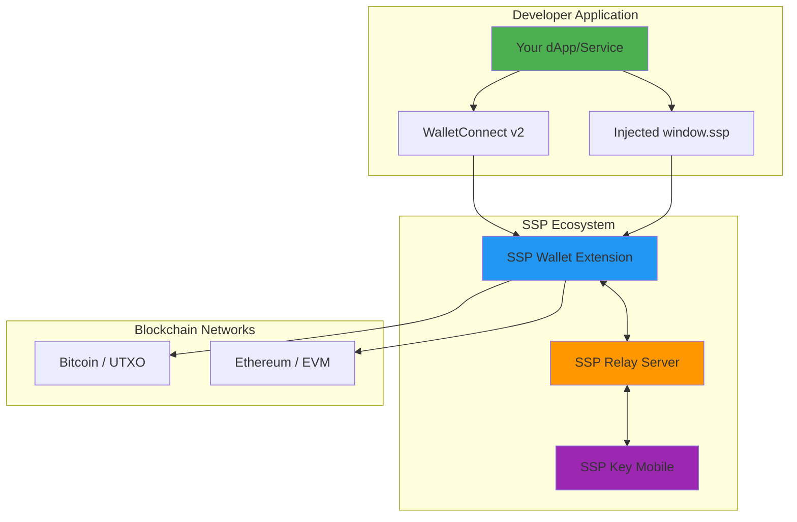

# Getting Started for Developers

## Welcome to SSP Development

SSP Wallet lets your web app or dApp request payments and signatures from a user whose funds are protected by a **2-of-2 multisignature** (SSP Wallet browser extension + SSP Key mobile). This guide covers the two integration surfaces and their **real** APIs.


**There are two separate surfaces — don't mix them up:**

1. **WalletConnect v2** — for standard **EIP-1193 `eth_*`** dApp flows (`eth_sendTransaction`, `personal_sign`, `eth_signTypedData_v4`, `wallet_switchEthereumChain`, …). SSP handles these **only** over WalletConnect.
2. **Injected `window.ssp` provider** — SSP's own method set (`pay`, `sign_message`, `chains_info`, …). This provider does **not** implement `eth_*` methods; calling them returns an "Invalid method" error.

Use WalletConnect if you already speak EIP-1193. Use `window.ssp` if you want SSP-native payment/signature requests across UTXO **and** EVM chains.


## 🏗️ SSP Development Stack

```typescript
// SSP Wallet Browser Extension (Current: v1.40.0)
React 19 + TypeScript + Vite
Manifest v3 Web Extension (Chrome 110+, Firefox 110+, Edge)
BIP48 HD Key Derivation (@scure/bip32, @scure/bip39)
Schnorr Multisig (@runonflux/aa-schnorr-multisig-sdk) for EVM ERC-4337
Injected global: window.ssp  (request/response only — no events)

// SSP Key Mobile App (Current: v1.28.0)
React Native + TypeScript, iOS 15.1+ / Android 7+
Package: io.runonflux.sspkey

// SSP Relay Server (coordination only)
Node.js + TypeScript + MongoDB, WebSocket + REST
Zero-knowledge design (no private key / seed access)
```

### Architecture Overview

```mermaid
graph TB
    subgraph "Developer Application"
        A[Your dApp/Service]
        B[WalletConnect v2]
        C[Injected window.ssp]
    end

    subgraph "SSP Ecosystem"
        D[SSP Wallet Extension]
        E[SSP Relay Server]
        F[SSP Key Mobile]
    end

    subgraph "Blockchain Networks"
        G[Bitcoin / UTXO]
        H[Ethereum / EVM]
    end

    A --> B
    A --> C
    B --> D
    C --> D
    D <--> E
    E <--> F
    D --> G
    D --> H

    style A fill:#4CAF50
    style D fill:#2196F3
    style E fill:#FF9800
    style F fill:#9C27B0
```

## 🚀 Option 1 — WalletConnect (for EIP-1193 / `eth_*` dApps)

**Best for**: existing EVM dApps, DeFi, NFT marketplaces that already use EIP-1193.

SSP Wallet pairs over WalletConnect v2 and handles the standard EVM method set: `eth_requestAccounts`, `eth_accounts`, `eth_sendTransaction`, `eth_sendRawTransaction`, `eth_sign`, `personal_sign`, `eth_signTypedData` / `_v3` / `_v4`, `wallet_switchEthereumChain`, `wallet_addEthereumChain`, `wallet_watchAsset`, `eth_chainId`, `net_version`, plus `chainChanged` / `accountsChanged` events.

```typescript
// Your dApp connects to SSP the same way it connects to any WalletConnect wallet.
// Use your existing WalletConnect / wagmi / web3modal setup and let the user
// pick "SSP Wallet". Every transaction still requires 2-of-2 approval
// (browser extension + mobile SSP Key), so expect a mobile approval step
// before a tx hash returns.
```


On EVM, SSP accounts are **ERC-4337 smart accounts** (not EOAs). `eth_signTransaction` (raw offline signing) is therefore rejected — use `eth_sendTransaction`, which submits a UserOperation signed by both keys.


## 🔌 Option 2 — Injected `window.ssp` provider (SSP-native)

**Best for**: web apps that want SSP-native payment and signature requests, across UTXO and EVM chains, without WalletConnect.

### The provider

```typescript
declare global {
  interface Window {
    ssp?: {
      // TWO positional args: a method string and a single named-fields object.
      request: (method: string, params?: Record<string, unknown>) => Promise<any>;
    };
  }
}

const isInstalled = typeof window.ssp !== 'undefined';
```


**Call shape matters.** The signature is `window.ssp.request(method, paramsObject)` — two positional arguments, where `params` is a **plain object of named fields**. It is **not** `request({ method, params })` and params is **not** a positional array. The global is `window.ssp` (there is no `window.sspwallet`).


### Response shape

- On success the promise **resolves** to an object: `{ status: 'SUCCESS', ...methodFields }` (e.g. `pay` → `{ status, txid }`). Always check `res.status === 'SUCCESS'`.
- On failure the promise **rejects** with an `Error` (`error.code` defaults to `4001` for user rejection). Wrap calls in `try/catch`.
- The injected provider is **request/response only — no event listeners** (no `accountsChanged`/`chainChanged`). Use WalletConnect if you need events.

### Supported methods

| Method | Purpose | Key params (object) | Resolves |
|--------|---------|---------------------|----------|
| `pay` | Request a payment / asset send | `{ address, amount, chain, message?, contract? }` | `{ status, txid }` |
| `sign_message` | Sign a message with a chain address | `{ message, address?, chain? }` | `{ status, signature, address, message }` |
| `sspwid_sign_message` | Sign with the SSP Wallet Identity (FluxID) | `{ message }` | `{ status, signature, address, message }` |
| `wk_sign_message` | 2-of-2 WK-Identity (P2WSH) message signing | `{ message, authMode?, origin, siteName?, description?, iconUrl? }` | `{ status, result: { walletSignature, walletPubKey, keySignature?, keyPubKey?, witnessScript, wkIdentity, message } }` |
| `chains_info` | List all chains SSP supports | *(none)* | `{ status, chains: [{ id, name, symbol, decimals, chainId? }] }` |
| `chain_tokens` | List tokens for a chain | `{ chain }` | `{ status, tokens: [{ contract, name, symbol, decimals }] }` |
| `user_chains_info` | Chains the user has synced | *(none)* | `{ status, chains }` |
| `user_addresses` | User's addresses for a chain (user consents) | `{ chain }` | `{ status, addresses: [string] }` |
| `user_chains_addresses_all` | User-approved addresses across synced chains | *(none)* | `{ status, chains: [{ id, name, symbol, decimals, addresses }] }` |

> `amount` is in **whole units** (e.g. `'4.124'`), `chain` is a chain id (`'btc'`, `'flux'`, `'eth'`, `'ltc'`, `'doge'`, `'zec'`, `'bch'`, `'rvn'`, … — call `chains_info` for the live list). See the authoritative reference in the SSP Wallet repo's `SSP_Wallet_API.md`. Enterprise integrators have additional `enterprise_*` methods (vault xpub / signing) that require the wallet to be synced with the SSP Key.

### Requesting a payment

```typescript
if (typeof window.ssp === 'undefined') {
  alert('SSP Wallet not found. Please install SSP Wallet.');
} else {
  try {
    // Every send is a 2-of-2 approval: the user confirms in the extension
    // AND on the SSP Key mobile app before a txid comes back.
    const res = await window.ssp.request('pay', {
      address: '0xRecipientOrChainAddress',
      amount: '0.01',          // whole units, not hex/wei
      chain: 'eth',            // 'btc' | 'flux' | 'eth' | 'ltc' | ...
      message: 'Invoice #1234' // optional memo
    });

    if (res.status === 'SUCCESS') {
      console.log('Broadcast tx:', res.txid);
    }
  } catch (error: any) {
    if (error.code === 4001) console.log('User rejected the request');
    else console.error('SSP request failed:', error.message ?? error);
  }
}
```

### Reading the user's addresses

```typescript
// Ask for addresses on one chain (the user chooses what to share):
const eth = await window.ssp!.request('user_addresses', { chain: 'eth' });
if (eth.status === 'SUCCESS') console.log(eth.addresses);

// Or everything the user has synced + approved:
const all = await window.ssp!.request('user_chains_addresses_all');
```

### Signing a message

```typescript
// Plain message signing on a given chain address:
const sig = await window.ssp!.request('sign_message', {
  message: 'Sign in to Example @ ' + Date.now(),
  chain: 'btc',
});
if (sig.status === 'SUCCESS') console.log(sig.signature, sig.address);

// 2-of-2 WK-Identity signing (both wallet + key sign). The message MUST be
// prefixed with a 13-digit millisecond timestamp; authMode 2 = wallet + key.
const wk = await window.ssp!.request('wk_sign_message', {
  message: `${Date.now()}:login-to-example`,
  authMode: 2,
  origin: window.location.origin,
  siteName: 'Example App',
});
if (wk.status === 'SUCCESS') {
  const { wkIdentity, witnessScript, walletSignature, keySignature } = wk.result;
}
```

## 🔐 Security Considerations

### Best practices

```typescript
function isValidEvmAddress(address: string): boolean {
  return /^0x[a-fA-F0-9]{40}$/.test(address);
}

async function safePay(address: string, amount: string, chain: string) {
  if (chain === 'eth' && !isValidEvmAddress(address)) {
    throw new Error('Invalid recipient address');
  }
  const res = await window.ssp!.request('pay', { address, amount, chain });
  if (res.status !== 'SUCCESS') throw new Error('Payment not completed');
  return res.txid;
}
```

### Guidelines
- ✅ **Validate user inputs** before requesting a `pay` / signature.
- ✅ **Always check `res.status === 'SUCCESS'`** and `try/catch` for rejection (`error.code === 4001`).
- ✅ **Use HTTPS** and never log signatures, keys, or seed phrases.
- ✅ **Expect a mobile approval step** — do not assume immediate confirmation.
- ❌ **Don't call `eth_*` on `window.ssp`** — those are WalletConnect-only.
- ❌ **Don't reference `window.sspwallet`** — the global is `window.ssp`.
- ❌ **Don't bypass SSP's 2-of-2 confirmations.**

## 🧪 Testing & Development

```typescript
// Mock the injected provider for tests — mirror the REAL shape:
// positional (method, params-object) and { status: 'SUCCESS', ... } responses.
class MockSSPProvider {
  async request(method: string, params?: Record<string, unknown>) {
    switch (method) {
      case 'user_addresses':
        return { status: 'SUCCESS', addresses: ['0x742d35Cc6634C0532925a3b8D404d8C92ca5c200'] };
      case 'pay':
        return { status: 'SUCCESS', txid: '0x123abc' };
      case 'sign_message':
        return { status: 'SUCCESS', signature: '0x456def', address: params?.address, message: params?.message };
      default:
        throw Object.assign(new Error(`Method ${method} not supported`), { code: 4001 });
    }
  }
}

// window.ssp = new MockSSPProvider() as any;
```

### Debugging

```typescript
console.log('SSP available:', typeof window.ssp !== 'undefined');

if (window.ssp) {
  try {
    const chains = await window.ssp.request('chains_info');   // real method
    console.log('Supported chains:', chains.chains);
  } catch (error) {
    console.error('SSP debug error:', error);
  }
}
// Note: the injected provider has no event listeners (unlike MetaMask).
// Re-query on user action or use WalletConnect if you need chain/account events.
```

## 📖 Example: Send button

```tsx
import React, { useState } from 'react';

function SendPayment() {
  const [recipient, setRecipient] = useState('');
  const [amount, setAmount] = useState('');
  const [isLoading, setIsLoading] = useState(false);

  const handleSend = async () => {
    if (!window.ssp) return alert('SSP Wallet not found. Please install SSP Wallet.');
    setIsLoading(true);
    try {
      const res = await window.ssp.request('pay', {
        address: recipient,
        amount,          // whole units, e.g. "0.01"
        chain: 'eth',
      });
      if (res.status === 'SUCCESS') {
        alert(`Transaction sent: ${res.txid}\nApproved on both devices.`);
      }
    } catch (error: any) {
      alert(error.code === 4001 ? 'Rejected by user' : `Failed: ${error.message ?? error}`);
    } finally {
      setIsLoading(false);
    }
  };

  return (
    <div>
      <input placeholder="Recipient address" value={recipient} onChange={(e) => setRecipient(e.target.value)} />
      <input placeholder="Amount (whole units)" value={amount} onChange={(e) => setAmount(e.target.value)} />
      <button onClick={handleSend} disabled={isLoading}>{isLoading ? 'Sending…' : 'Send'}</button>
    </div>
  );
}
```

For EVM contract interactions (swaps, approvals, arbitrary `data`), use the **WalletConnect** path with standard `eth_sendTransaction` — the injected `window.ssp` provider intentionally exposes only the high-level methods above.

## 🆘 Support & Resources

- **[API Reference](api-reference.md)** — SSP Relay API
- **`SSP_Wallet_API.md`** (in the ssp-wallet repo) — authoritative injected-provider reference + a working `SSP_Wallet_API_Example.html`
- **GitHub Issues**: [Report bugs / request features](https://github.com/RunOnFlux/ssp-wallet/issues)
- **GitHub Discussions**: [Ask questions](https://github.com/RunOnFlux/ssp-wallet/discussions)

---

**Two surfaces, one wallet: WalletConnect for EIP-1193 `eth_*`, or the injected `window.ssp` provider for SSP-native `pay` / `sign_message` requests — both enforce 2-of-2 approval.**
