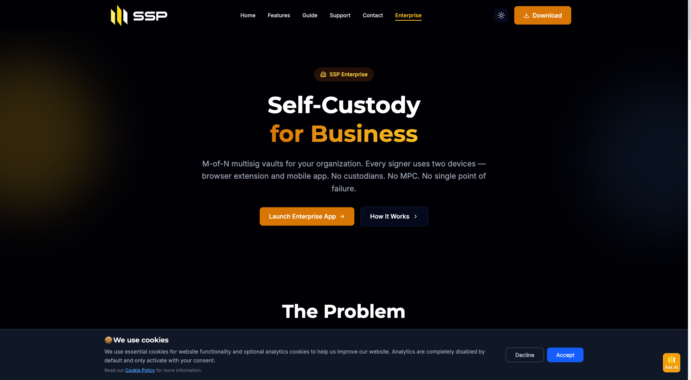

# SSP Enterprise

SSP Enterprise is multi-party crypto custody for teams. Your organization holds the keys, your team co-signs transactions, and the platform handles the coordination — proposals, approvals, audit trail, and policy enforcement.

It runs on the same two-device security model as SSP Wallet (browser extension + mobile app), but instead of one person controlling one wallet, your team collectively controls organizational vaults.

🌐 **Live at:** [enterprise.sspwallet.com](https://enterprise.sspwallet.com)

<div align="left"><figure><figcaption>Self-custody multisig for organizations — see <a href="https://sspwallet.io/enterprise">sspwallet.io/enterprise</a></figcaption></figure></div>

## What you actually get

* **Vaults that are real on-chain multisigs.** Not a custodian. Not MPC with a vendor share. Native Bitcoin multisig and EVM smart contract multisig, derived from your signers' xpubs.
* **Pick your threshold.** 2-of-3 for a small team. 3-of-5 for a treasury council. 5-of-9 for a board. Whatever matches how your team actually makes decisions.
* **Two devices per signer.** A compromised laptop alone can't sign. A compromised phone alone can't sign. Both, on every signature, every signer.
* **One platform, twelve chains.** BTC, ETH, LTC, DOGE, BCH, ZEC, RVN, FLUX, MATIC, BNB, AVAX, BASE — without juggling tools.
* **A policy engine that's actually configurable from the UI.** Spending limits, address whitelists, time-locks, admin approvals, per-signer overrides. No Solidity. No modules to deploy.
* **An audit log you can hand to an auditor.** Every member change, vault op, proposal, and signature, attributed and timestamped.
* **Open source.** SSP Wallet and SSP Key are public. The cryptography is verifiable.

## How the pieces fit

```
SSP Wallet (browser extension)  ←→  SSP Enterprise  ←→  SSP Key (mobile app)
            │                       (web app at                  │
            │                  enterprise.sspwallet.com)         │
            └───────────── 2-of-2 WK Identity ────────────────────┘
                                    │
                                    ▼
                       Multi-party multisig vaults
                          (M-of-N across team)
```

* **WK Identity** is your unique cryptographic identity, derived from a 2-of-2 multisig of your SSP Wallet + SSP Key public keys. No password. No email required for first login. You sign in by signing a challenge with both devices.
* **Organizations** group your team. One owner, several admins, members, viewers.
* **Vaults** are the M-of-N multisig wallets where funds live. One organization can have many vaults across different chains.
* **Proposals** are transactions waiting on signers. Each designated signer approves with their wallet + key. Threshold met → broadcast.

## What you need before signing in

Every team member who'll be on a vault needs to be set up as an SSP Wallet user first:

1. **SSP Wallet** browser extension — [Chrome](https://chromewebstore.google.com/detail/ssp-wallet/mgfbabcnedcejkfibpafadgkhmkifhbd) or [Firefox](https://addons.mozilla.org/firefox/addon/ssp-wallet)
2. **SSP Key** mobile app — [iOS](https://apps.apple.com/app/ssp-key/id6463717332) or [Android](https://play.google.com/store/apps/details?id=io.runonflux.sspkey)
3. **Wallet + Key paired and synced** — see the [SSP Wallet first-time setup](../quick-start/first-time-setup.md)

Once that works as a normal personal wallet, you can sign in to SSP Enterprise.

## Walkthroughs

The product, end to end:

1. **[Getting Started](getting-started.md)** — sign in for the first time
2. **[Creating Your First Organization](creating-organization.md)** — set up the workspace
3. **[Inviting Team Members & Roles](inviting-members.md)** — bring your team in
4. **[Creating Multisig Vaults](creating-vaults.md)** — set up M-of-N vaults per chain
5. **[Proposing & Signing Transactions](transactions.md)** — move funds with collective approval
6. **[Configuring Policy Controls](policies.md)** — spending limits, whitelists, time-locks

## Switching from another platform?

* [Migrating from Fireblocks](migration/from-fireblocks.md)
* [Migrating from Safe (Gnosis Safe)](migration/from-safe.md)
* [Migrating from BitGo](migration/from-bitgo.md)

## Setting up for a specific use case?

* [DAO Treasury Management](use-cases/dao-treasury.md)
* [Corporate Treasury Workflow](use-cases/corporate-treasury.md)

## Help

* **Sales / custom plans:** email [tadeas@sspwallet.com](mailto:tadeas@sspwallet.com) or [book a 30-min call](https://calendar.app.google/NZd7n1d6Hjmd7XFD6)
* **Technical issues:** [GitHub Issues](https://github.com/RunOnFlux/ssp-wallet/issues)
* **Security:** see the [Security Overview](../security/security-overview.md)
