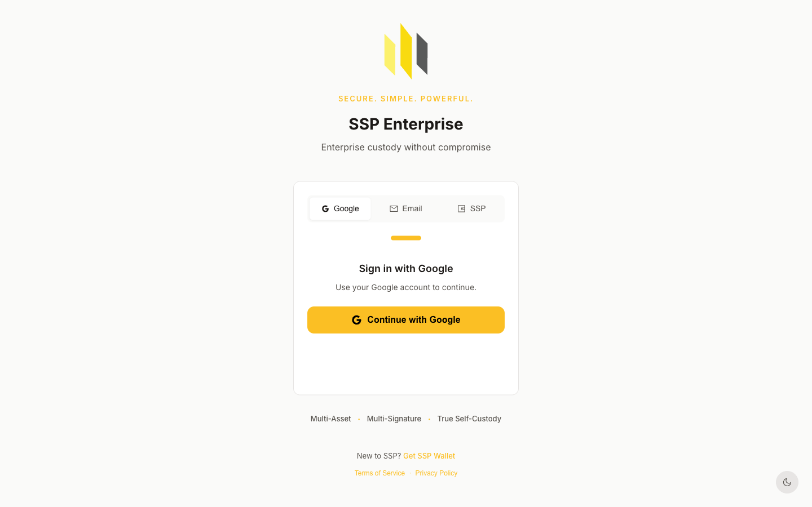

# Getting Started with SSP Enterprise

Your first sign-in goes through your **WK Identity** — proving you control both your SSP Wallet and your SSP Key by signing a challenge with both. After that, you can attach an email or Google account for faster access on subsequent visits.

## What you need

* SSP Wallet browser extension installed and unlocked
* SSP Key mobile app installed, paired with your wallet, unlocked
* Both devices online (your phone needs internet to receive the sign-in approval)

If your wallet + key aren't set up yet, do that first: [SSP Wallet first-time setup](../quick-start/first-time-setup.md).

## Sign in

Go to **[enterprise.sspwallet.com](https://enterprise.sspwallet.com)**.

You'll see three tabs: Google, Email, SSP. Pick **SSP** — that's the one that uses your wallet and key.

<figure><figcaption>The SSP Enterprise login screen at enterprise.sspwallet.com</figcaption></figure>

If your SSP Wallet extension isn't installed, install buttons appear here. Once it's installed, refresh and continue.

Click **Sign in with SSP Wallet**. Two prompts arrive at once:

1. **In your SSP Wallet extension** — review the request, click Approve. The wallet signs the sign-in challenge.
2. **On your phone, in SSP Key** — same request, same challenge. Approve with PIN or biometric.

The browser shows **Verifying...** while the server checks both signatures match your WK Identity. On success, you land on the Organizations page (if you're new) or your Dashboard (if you already belong to an org).

## What just happened

You signed a one-time challenge with two private keys, one on each device. The server verified both signatures, confirmed they belong to your WK Identity, and gave you a session.

No password got created. No email is required. Your WK Identity is the source of truth — everything else is convenience.

## Want faster sign-in next time?

Once you're in, you can attach an email or Google account so you don't need both devices online for routine logins.

* **Why bother?** Logging in from a coffee shop laptop is painful if you also need to dig out your phone every time.
* **Why it's still secure:** email and Google sign-in only work *after* WK Identity is established. They're attached *to* your identity, not replacements for it.
* **Critical actions still need WK signing.** Transferring ownership, removing members, deleting an org, changing your linked email — these prompt your wallet + key regardless of how you signed in.

To attach: open **Profile → Linked Accounts → Add Email** or **Add Google**.

## Next

* **[Create your first organization](creating-organization.md)** — set up the workspace where your vaults live
* **[Invite team members](inviting-members.md)** — bring others in
