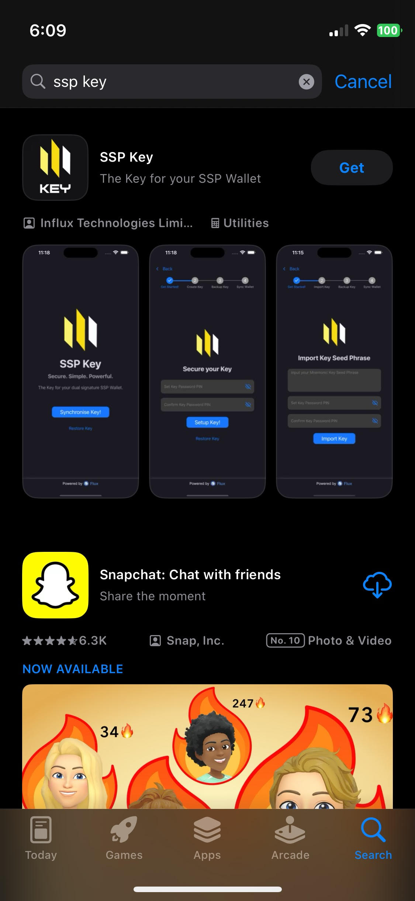
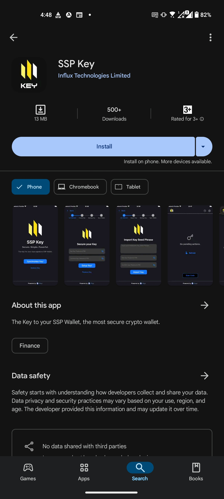

# Install SSP Key


SSP Key can be downloaded on either Android or IOS

* iOS: [https://apps.apple.com/us/app/ssp-key/id6463717332](https://apps.apple.com/us/app/ssp-key/id6463717332)&#x20;
* Android: [https://play.google.com/store/apps/details?id=io.runonflux.sspkey](https://play.google.com/store/apps/details?id=io.runonflux.sspkey)


<figure><figcaption></figcaption></figure>

<figure><figcaption></figcaption></figure>

Click "Install" for Android users and "Get" for iOS users


Installation time may vary base on your internet connection. It is recommended to use a network with stable internet connection.


After installing the SSP Key you may now open the app.


For Android users you will be ask to give permission to send you notifications, this is optional and base on your preference.


After giving permission to SSP Key, you may now open and use it

<figure><figcaption></figcaption></figure>

Congratulations for installing SSP Key to your device!
