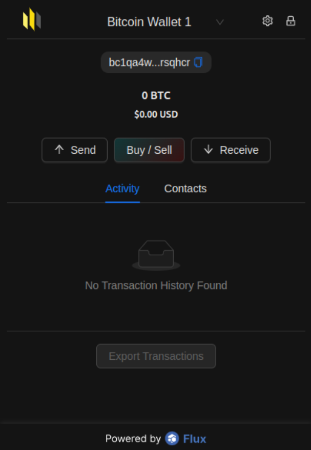

# Restore Key Using Seed Phrase and Syncing to SSP Wallet


Restoring Key using Seed Phrase is a way to restore your key using your backed up seed phrase when you created your key.


<figure><figcaption></figcaption></figure>

Click "Restore Key"

<figure><figcaption></figcaption></figure>

Provide your backed up seed phrase on "Input your Mnemonic Key Seed Phrase" text area. Also, provide password value on "Set SSP Key Password" and "Confirm Key Password".

Click "Import Key" button

<figure><figcaption></figcaption></figure>

Click "Show Mnemonic Key Seed Phrase"


Please make sure you backup your seed phrase as this serves as your control over your wallet. Losing the wallet seed will result in loss of access to your key. By clicking "Show Mnemonic Wallet Seed Phrase" you will be presented with your own unique seed phrase.


After you backup your seed phrase toggle "I have backed up my keys seed phrase in a secure location." then click "Setup Key!"

In your SSP Wallet click settings icon

<figure><figcaption></figcaption></figure>

<figure><figcaption></figcaption></figure>

Click "SSP Wallet Details"

<figure><figcaption></figcaption></figure>

Input your password on "Confirm with Password" , then click "Grant Access" button

<figure><figcaption></figcaption></figure>

Scroll down and you will find SSP Sync with SSP Key

<figure><figcaption></figcaption></figure>

<figure><figcaption></figcaption></figure>

Click unhide icon

<figure><figcaption></figcaption></figure>

In your SSP Key click "Scan Code" to scan the QR code in your SSP Wallet


SSP Key needs to have permission to take picture, it is recommended to select allow while using the app.


<figure><figcaption></figcaption></figure>


For iOS users you can go to Settings > Apps >  SSP Key , then find the camera settings and toggle on


After scanning the SSP Wallet QR code, click "Approve Syncronisation" on your SSP Key

<figure><figcaption></figcaption></figure>

Please type your password in the "Confirm Key Password" text box, then click "Confirm"

<figure><figcaption></figcaption></figure>


You can also use the fingerprint scanner or face recognition of your device in syncing


Congratulations for restoring your key and synching your SSP Wallet and SSP Key!
